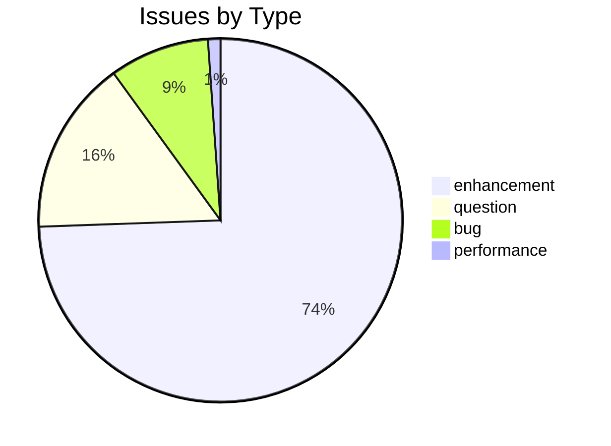
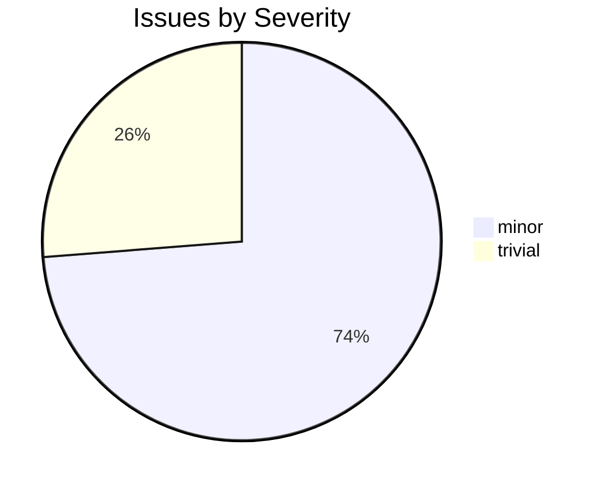

# COLOGNE

CDSL **build-meta** repository in the Sanskrit Lexicon project.

## Issues Overview

**Total**: 100 | **Open**: 71 | **Closed**: 29

### By Milestone

| Milestone | Open | Closed | Total |
|---|---|---|---|
| Unassigned | 71 | 29 | 100 |

### By Type

### By Severity

## GitHub Issue Conventions

Follows the [Cologne tooling-repo taxonomy](https://github.com/sanskrit-lexicon/csl-observatory/blob/main/runbook/cologne-tooling-runbook.md):

- **9 type labels**: bug, feature, enhancement, performance, tech-debt, security, documentation, infrastructure, question
- **4 severity levels**: trivial, minor, major, critical
- **5 milestones**: API Stability, User Experience, Data Quality, Developer Experience, Community
- **Org Project**: [Tooling Roadmap](https://github.com/orgs/sanskrit-lexicon/projects/9)

See [CLAUDE.md](CLAUDE.md) for full definitions.

## Contents

| File / directory | Purpose |
|---|---|
| [CROSSREF_INDEX.md](CROSSREF_INDEX.md) | Navigational map to all CDSL repos and external resources |
| [ARCHITECTURE_REVIEW.md](ARCHITECTURE_REVIEW.md) | Architecture review roadmap |
| [CLAUDE.md](CLAUDE.md) | Guidance for Claude Code; issue taxonomy reference |
| [CONTRIBUTING.md](CONTRIBUTING.md) | How to contribute |
| [CODE_OF_CONDUCT.md](CODE_OF_CONDUCT.md) | Community standards |
| [CITATION.cff](CITATION.cff) | Machine-readable citation record |
| [LICENSE](LICENSE) | MIT licence |
| [readme_new_dict_addition.md](readme_new_dict_addition.md) | How to add a new dictionary to the CDSL |
| `api/`, `aws/`, `docs/`, `tools/`, … | Working subdirectories for infrastructure tasks |

## Org-wide resources

| Resource | Link |
|---|---|
| All CDSL repos | [CROSSREF_INDEX.md](CROSSREF_INDEX.md) |
| Cologne CDSL website | https://www.sanskrit-lexicon.uni-koeln.de/ |
| Contributing guide | [CONTRIBUTING.md](CONTRIBUTING.md) |
| Cross-dictionary corrections | [csl-corrections](https://github.com/sanskrit-lexicon/csl-corrections) |
| Tooling Roadmap (org project) | [GitHub Project](https://github.com/orgs/sanskrit-lexicon/projects/9) |

## Contact

| Role | GitHub |
|---|---|
| Primary maintainer | [@funderburkjim](https://github.com/funderburkjim) |
| Digitisation lead | [@Andhrabharati](https://github.com/Andhrabharati) |
| Contributor | [@drdhaval2785](https://github.com/drdhaval2785) |

---
*Generated by Cologne Tooling Runbook on 2026-05-15*
